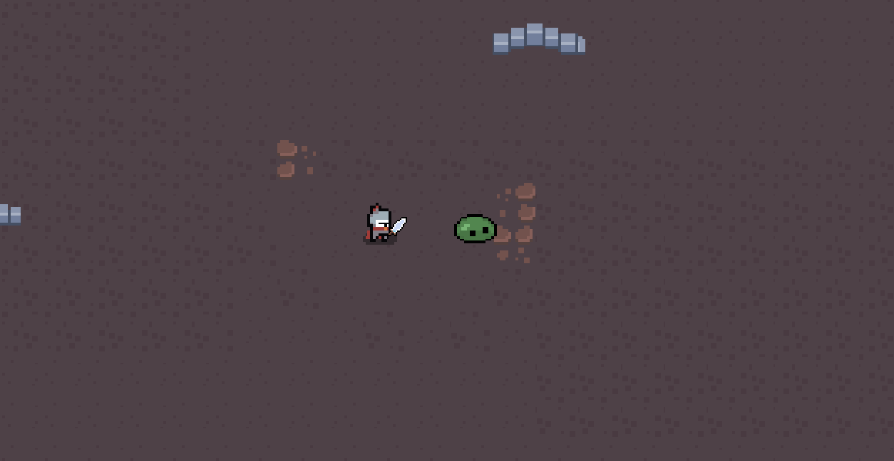

# DUNGEON CRAWLER  
(In development, only scripts uploaded)

## Project Description
Fight incoming waves of blobs.

### Built With
- Unity Version (Unity 2021.3.25f1)

## Gameplay
- movement using W,A,S,D as up, left, down, right
- left click to attack.
- Attacks will knockback enemy
- right click to activate statis (freeze enemy in range)
- goblins will spwan and target you automatically. Getting hit by blob will incur damage

## Still in development
- this (along with other games on github) were to test unity and coding in unity. I would love to continue on building a game when I have more time.

